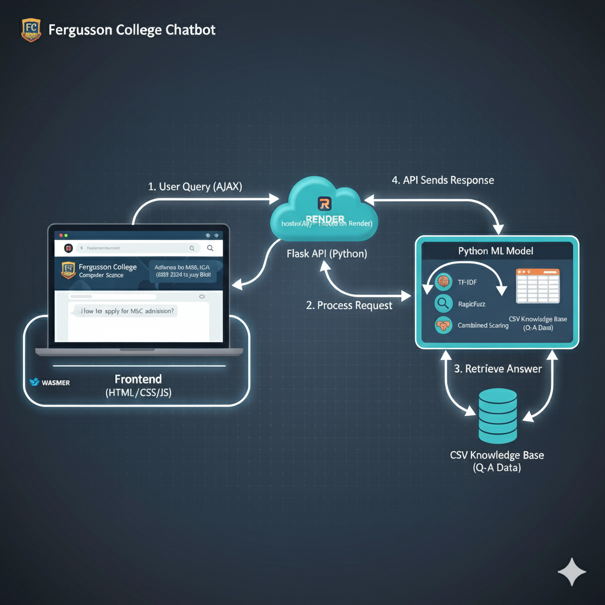

# 🏫 Fergusson College – Query Chatbot Website

**Author:** Jatin Joshi  
**Institution:** Fergusson College, Pune  
**Course:** MSc.CA, First Year  

---

## 🤖 Project Overview

This project is designed to simplify the student admission process and general inquiry handling using an interactive chatbot built with **PHP and Python**.  
The website also showcases essential details about the **college, faculty, courses, infrastructure, and events**, providing an all-in-one information hub.

---

## 🚀 Key Features

- 💬 **Chatbot System** – Answers FAQs related to admissions, courses, fees, and more.  
- 🧠 **Database-Driven Responses** – Chatbot fetches accurate data from MySQL tables.  
- 🏛️ **About Fergusson College** – Historical background, founders, and legacy.  
- 👨‍🏫 **Faculty Section** – Interactive flip-card layout of department faculty.  
- 📚 **Courses Page** – Semester-wise course information for MSc Computer Applications.  
- 🏫 **Infrastructure & Labs** – Details of campus facilities and computing labs.  
- 📢 **Notices & Events** – Dynamic section for announcements and department activities.  
- 🔐 **User Login / Registration** – For managing personalized queries (optional).  
- 📱 **Fully Responsive Design** – Optimized for desktops, tablets, and mobile devices.

---

## 🛠️ Tech Stack

| Layer | Technologies Used |
|-------|--------------------|
| **Frontend** | HTML5, CSS3, JavaScript |
| **Backend** | PHP/Python |
| **Database** | CSV |
| **Version Control** | Git & GitHub |
| **Server Environment** | XAMPP / Apache on localhost |

---

## ChatBot Flow Diagram

---

## ⚙️ Setup Instructions

### 1️⃣ Clone the Repository

git clone https://github.com/yourusername/fergusson-chatbot-website.git
2️⃣ Move to XAMPP Folder
Place the cloned project inside:

makefile
Copy code
C:\xampp\htdocs\
3️⃣ Start Localhost Server
Open XAMPP Control Panel

Start Apache and MySQL

4️⃣ Create the Database
Open your browser and go to http://localhost/phpmyadmin

Create a new database named:

nginx
Copy code
admission_chatbot
Import the SQL file provided in the project (example: database/admission_chatbot.sql)

5️⃣ Run the Project
Open your browser and visit:

arduino
Copy code
http://localhost/fergusson-chatbot-website

---

## 📄 Project Purpose

Developed as part of the **MSc Computer Applications (MSc.CA)** course at **Fergusson College, Pune**, this project demonstrates how a **chatbot system** can streamline communication between students and the college.  
It aims to make **college information, admissions, course details, and FAQs** easily accessible to students through an interactive, database-driven chatbot interface.

---

## 🌟 Future Improvements

- 🧩 Add an **Admin Dashboard** to manage chatbot responses and FAQs dynamically.  
- 🧠 Integrate **Natural Language Processing (NLP)** for smarter, context-based answers.  
- 💬 Store and display **chat history** for better user experience and tracking.  
- 🌐 **Host the project online** for public access and real-world usability.

---

MIT License

Copyright (c) 2025 Gobu

Permission is hereby granted, free of charge, to any person obtaining a copy
of this software and associated documentation files (the "Software"), to deal
in the Software without restriction, including without limitation the rights
to use, copy, modify, merge, publish, distribute, sublicense, and/or sell
copies of the Software, and to permit persons to whom the Software is
furnished to do so, subject to the following conditions:

The above copyright notice and this permission notice shall be included in all
copies or substantial portions of the Software.

THE SOFTWARE IS PROVIDED "AS IS", WITHOUT WARRANTY OF ANY KIND, EXPRESS OR
IMPLIED, INCLUDING BUT NOT LIMITED TO THE WARRANTIES OF MERCHANTABILITY,
FITNESS FOR A PARTICULAR PURPOSE AND NONINFRINGEMENT. IN NO EVENT SHALL THE
AUTHORS OR COPYRIGHT HOLDERS BE LIABLE FOR ANY CLAIM, DAMAGES OR OTHER
LIABILITY, WHETHER IN AN ACTION OF CONTRACT, TORT OR OTHERWISE, ARISING FROM,
OUT OF OR IN CONNECTION WITH THE SOFTWARE OR THE USE OR OTHER DEALINGS IN THE
SOFTWARE.
